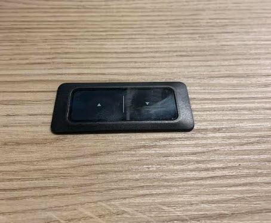
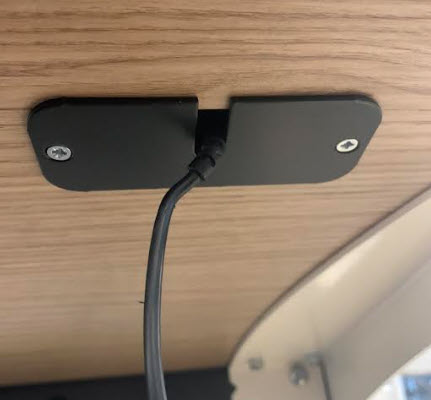
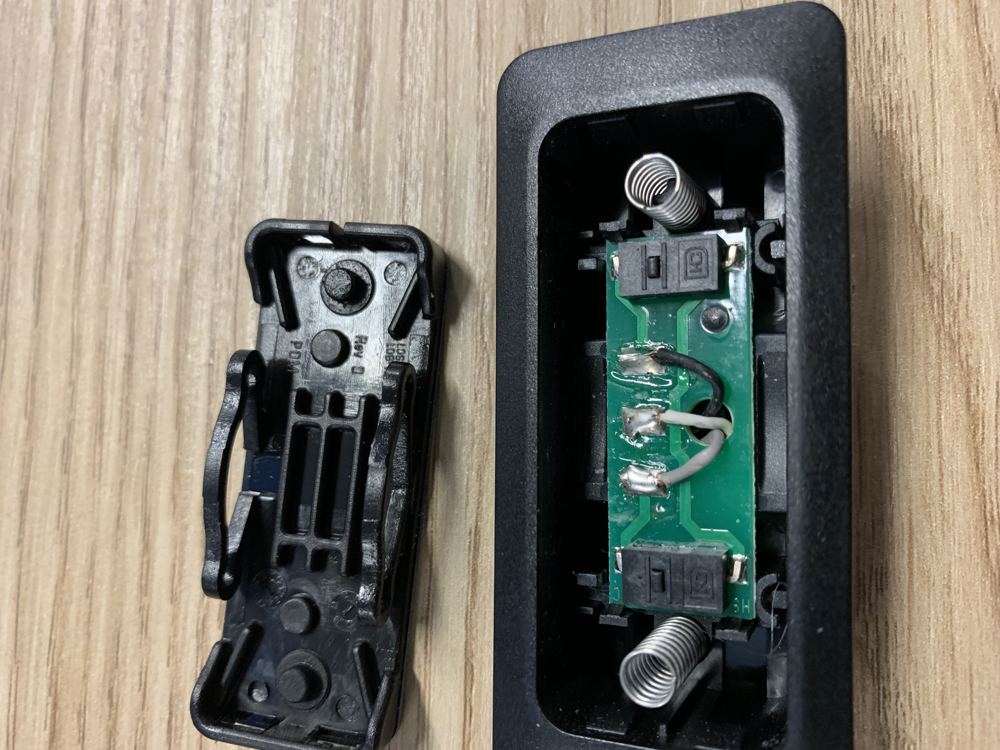
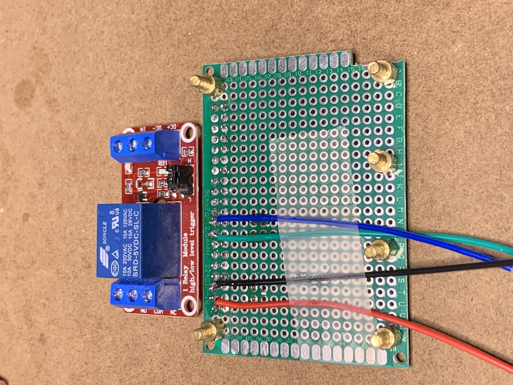
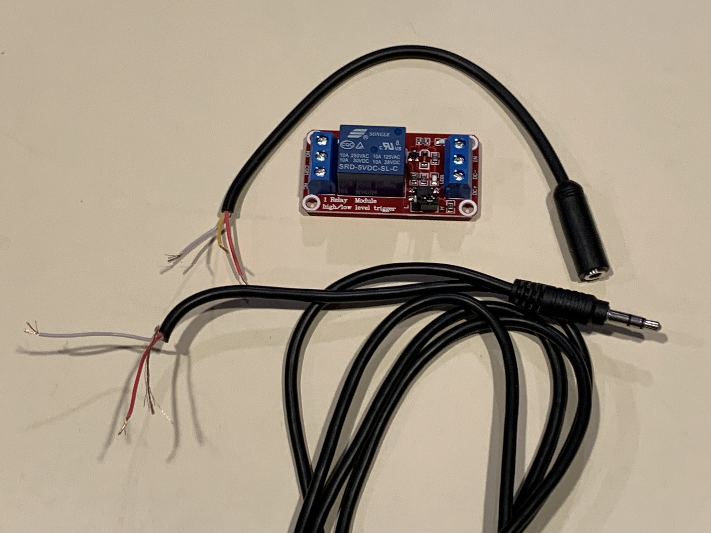
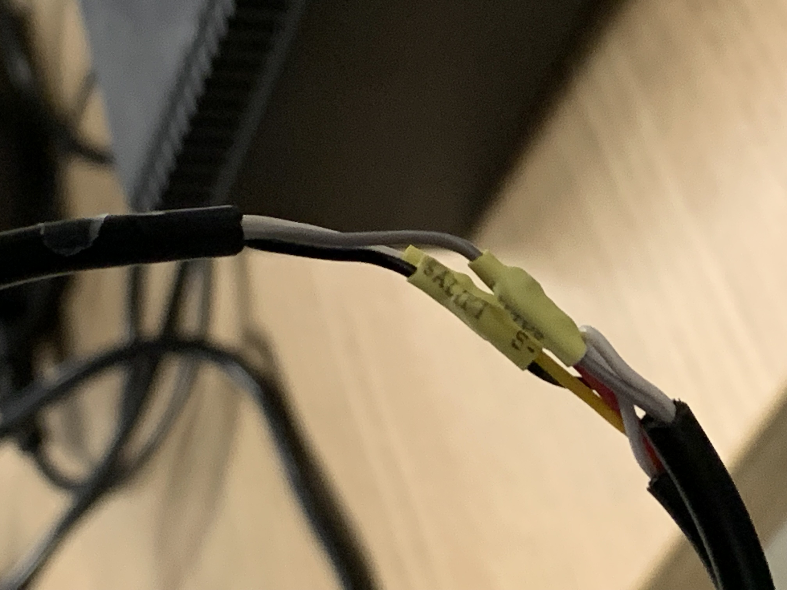
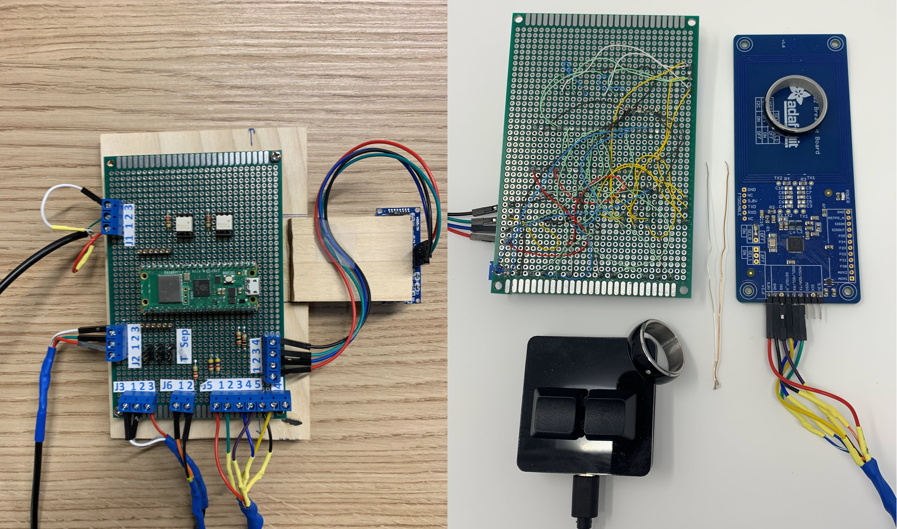
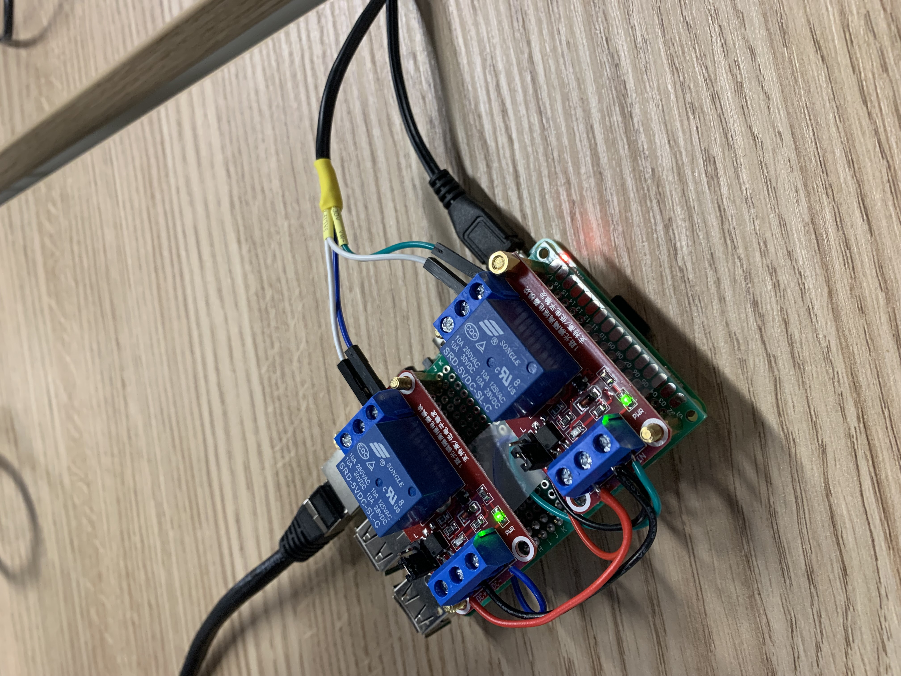
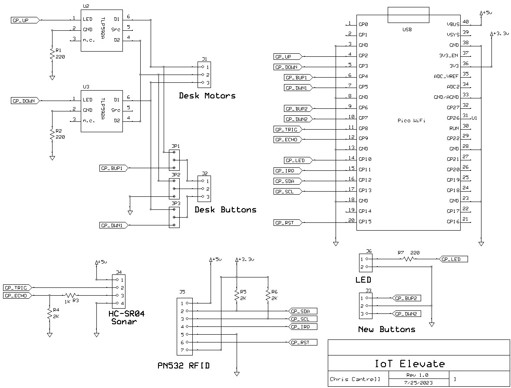

# iot-elevate

Hacking the controls that raise/lower my desk



















# Wiring
```                     Gray         Red
     Motors/        UP --------  X  --------  Connectors
     Buttons
                        White        Green 
                COMMON --------  X  --------

                        Black        White
                  DOWN --------  X  --------

The male connector with pins covered connects to the desk motor controller.

The female connector with the pins shrouded connects to the desk buttons.
```

# Height sensor

https://thepihut.com/blogs/raspberry-pi-tutorials/hc-sr04-ultrasonic-range-sensor-on-the-raspberry-pi


