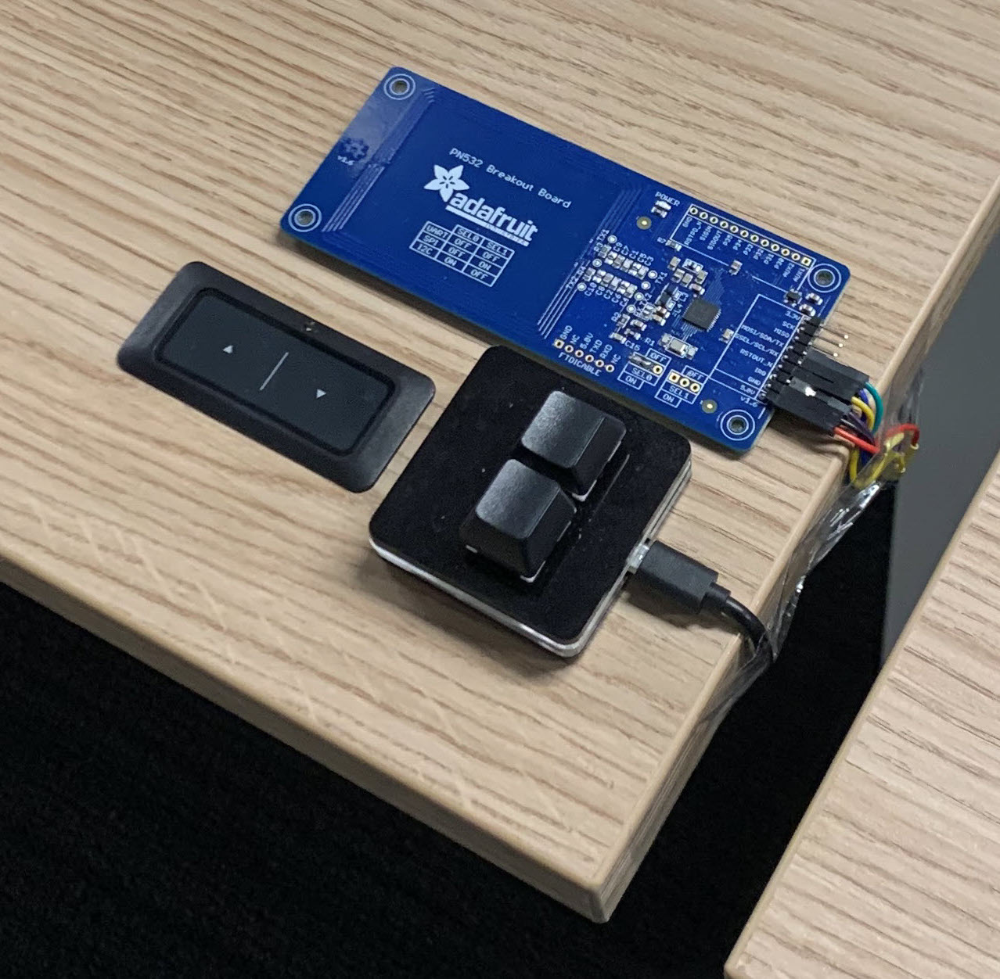
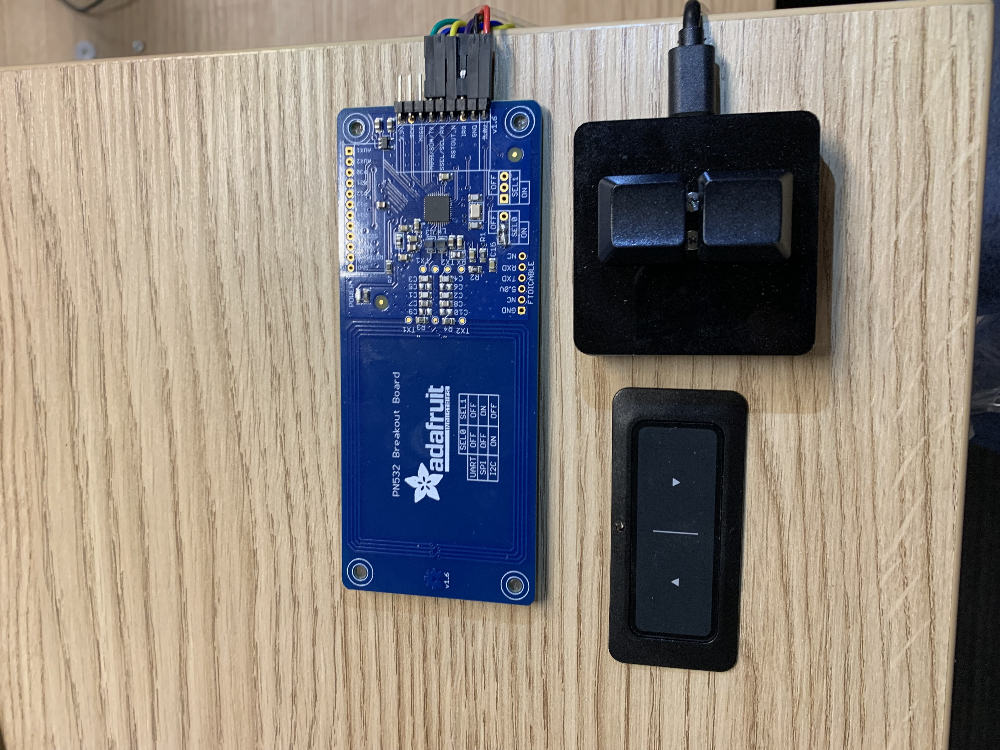
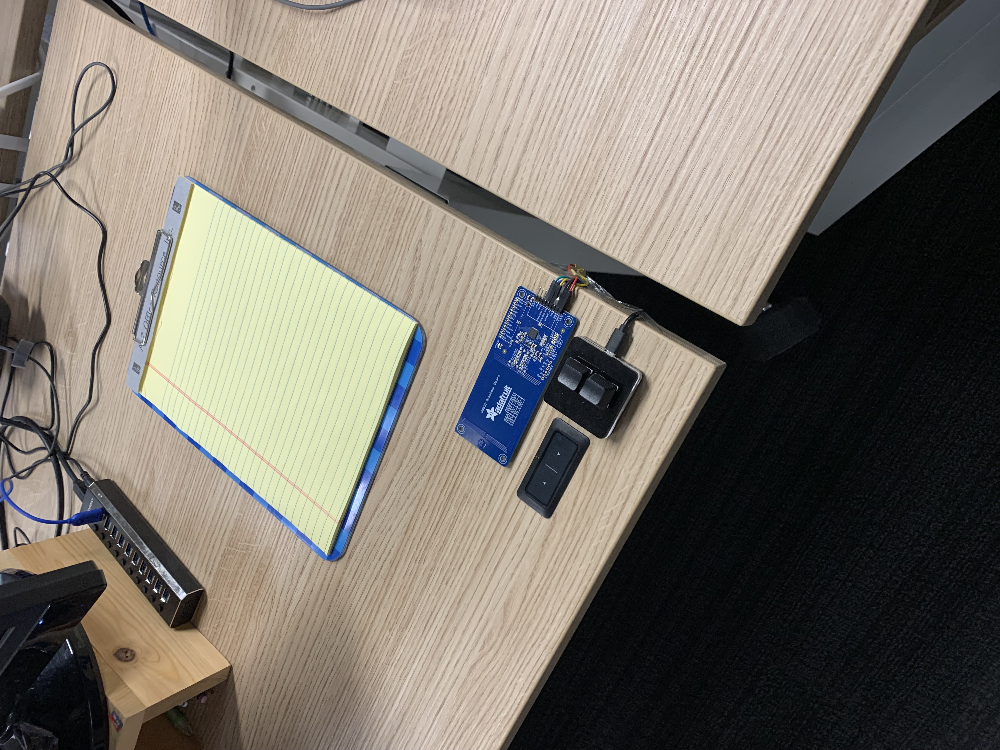
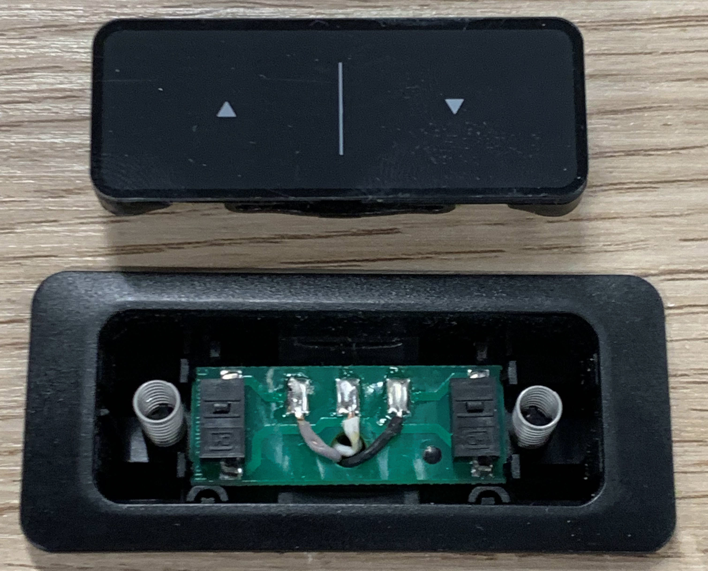
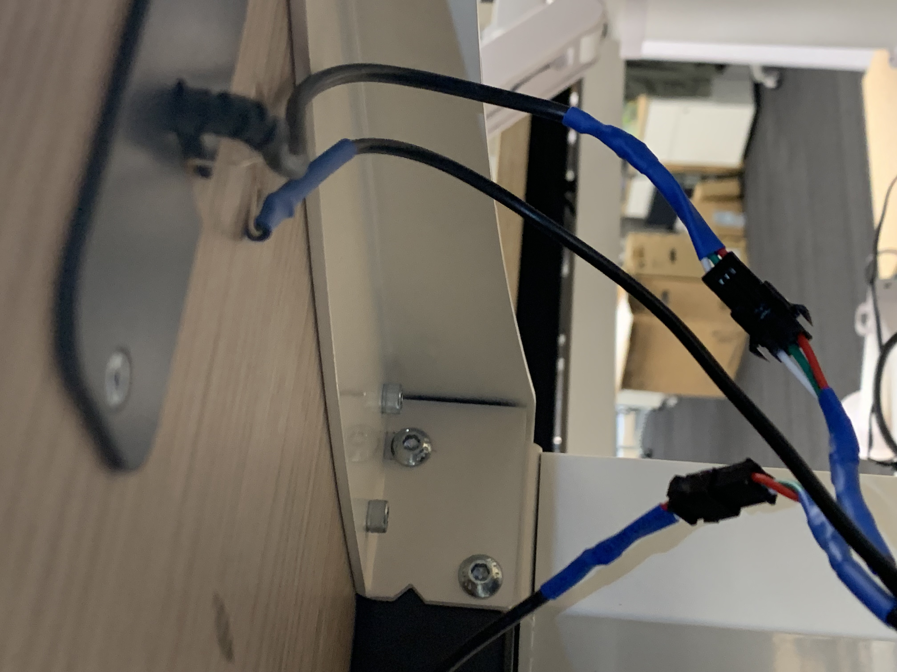
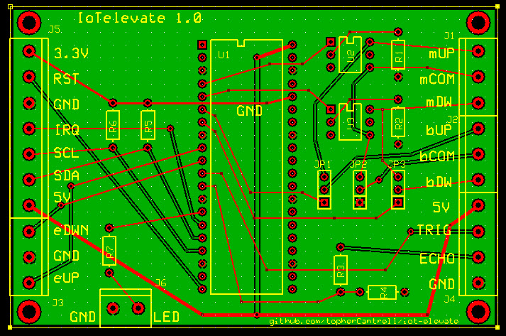
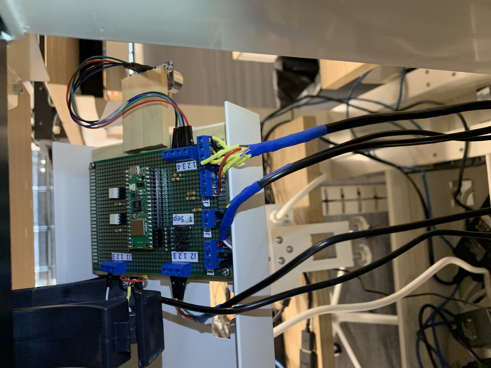
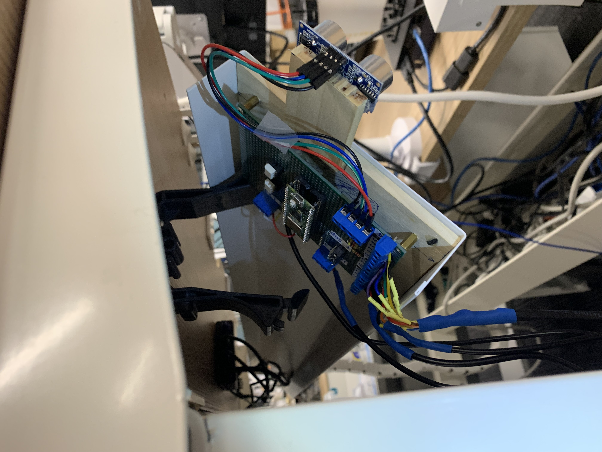

# IoT Desk Controller

Adding a microcontroller and an Adafruit RFID ring reader to control the height of my desk at work. Waving
your hand over the desk to move it feels like using the Force!

See the detailed article in Circuit Cellar magazine:

https://circuitcellar.com/research-design-hub/projects/iot-desk-controller/

# Mounted Desk Controls

Here are the controls on the corner of my desk. There are two buttons (up/down) and the RFID ring reader.

# Hacking the Desk

My desk has no smarts. It has an up button and down button. You must hold the buttons down to adjust the desk height.

I opened the button panel on the desk. It is just 3 wires: up, down, and common. Pressing a button shorts one of the
direction wires to the common.

I add quick-connects to the wiring under the desk.

I used a sonic distance sensor to measure desk height. I got mine from Adafruit:

https://thepihut.com/blogs/raspberry-pi-tutorials/hc-sr04-ultrasonic-range-sensor-on-the-raspberry-pi

I used an Adafruit RFID reader and an Adafruit ring to control the desk height: https://www.adafruit.com/product/364

Wave the ring over the reader to move the desk to one of two preset heights. Hold down a button to record the desk's 
current height as either the "top" or "bottom" setting.

I used two Toshiba solid state photorelays to short the desk wires. The datasheet is in this repo.

I used an RPI2040 micro controller and Circuit Python. The code is the "src" directory of this repo.

Here is the controller schematic:

Here is the finished board:

I also made a PCB for the final project. Here is a picture of the board. The ExpressPCB files are in the repo.

Here is the control board mounted in the cable tray under my desk:

